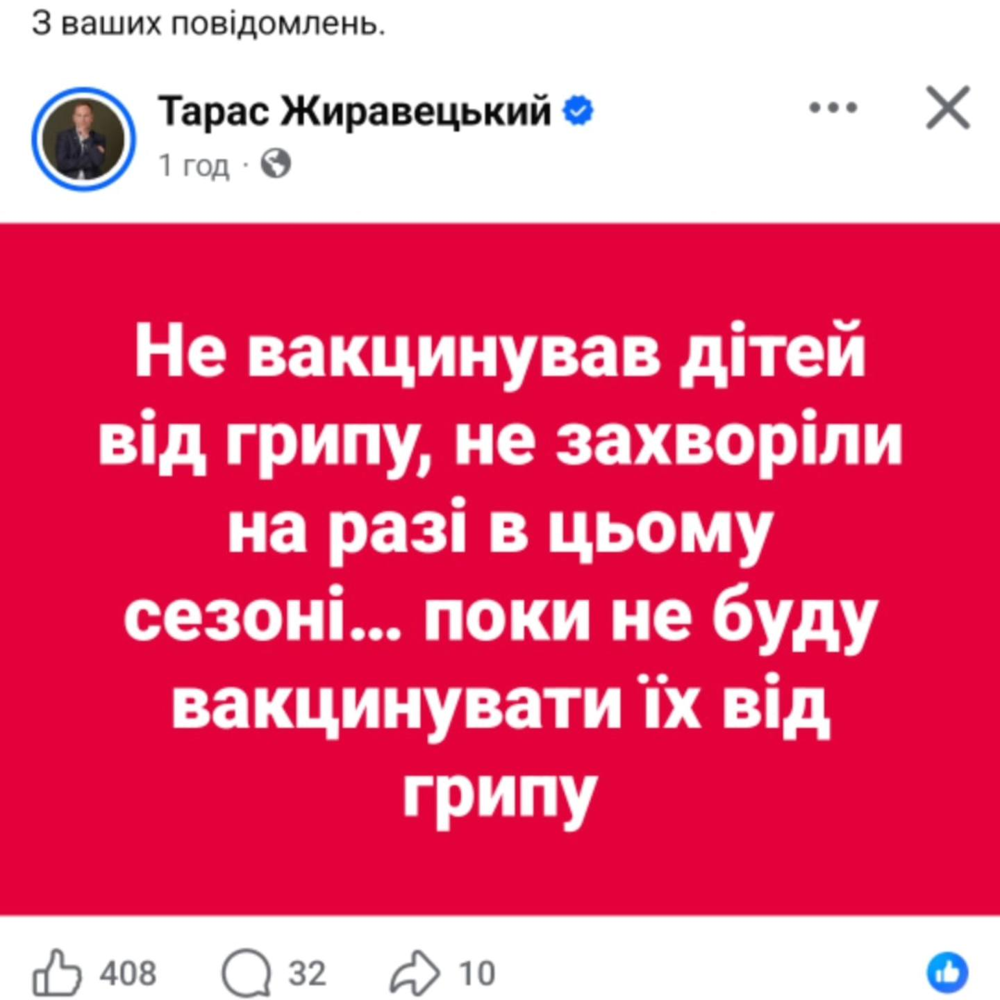
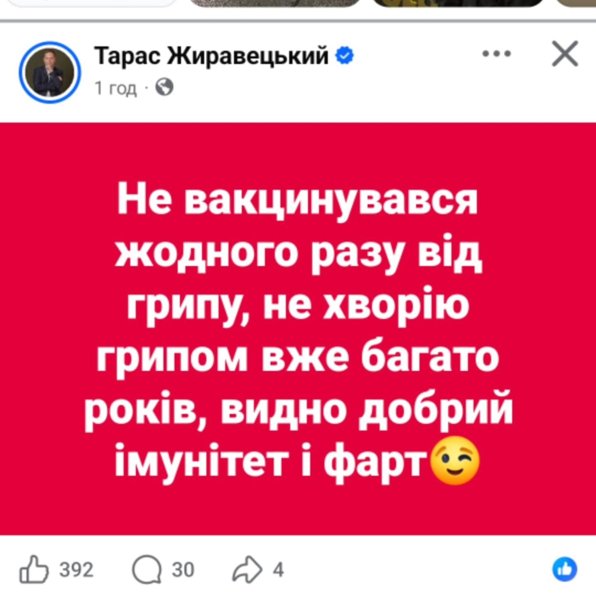
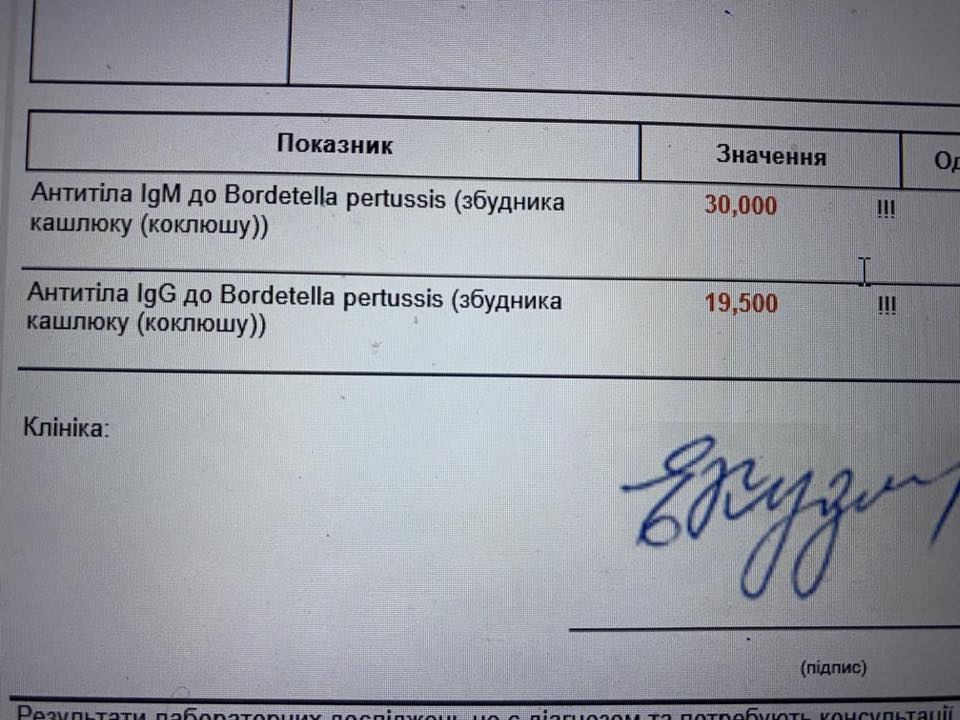

Автор [Yaroslav Vus](https://www.facebook.com/yaroslav.vus)  
<u>26 лютого 2026 р.; 19:13</u>  
Чому ми так погано живемо і маємо стільки бід?

Та тому що в цього чорта 327 тисяч підписників, а в мене 15.

Чорновіл і Кравчук - пам'ятаєте? Ми завжди обираємо не те((((

Також він радить дітям збивати температуру одразу і НІМЕСИЛОМ.  

  
  
  
  
## Коментарі
Поліна Кравченко
> Чудовий доказовий лікар. І говорить правильні речі. І він не антивакс, а не підтримує комерційну вакцинацію, яка немає сенсу.
І таки температуру при грипі потрібно збивати одразу

Арсен Вівчарик
> Він видаляє коменти всіх хто його критикує.
В мережі немає однозначної інформації що до його освіти, ймовірно шо він взагалі медичний факультет універу не закінчував.
Читав скріни його переписок з пацієнтами, в нього манія величі, хоча знання практично відсутні, а ті що присутні, перемішані з байками бабусь з підїзду.
Зверніть увагу, мова якою він пише пости свідчить про відсутність освіти, він пише на рівні немедика, саме тому простим людям так і резонують його пости. + Він часто пише шкідливе але приємне.
Я не розумію чому цього злочинця досі не прикрили, як можна писати шкідливі і брехливі пости, і не пожинати жодних наслідків.

Лилия Шупрудько
> Що сталося з тими хто від ковіда вакцинувався? У 50% автоімунні захворювання. Вакцини такий же бізнес у медицині як і все інше. Нічого гарного в них не має. Якщо імунна система сильна, то пронесе, а якщо ні, то наслідків більше ніж користі

Mariana Gorban
> Певно тому, що людей легко тримати за дурнів, бо вони самі вірять в дурню, як у випадку цього" лікаря" від всіх болячок, він шкідливий персонаж, сумно, що люди цього не бачать...

Vika Shestakova - Stoliarchuk
> Я не лікар, але всі призначення і рекомендації Тараса - повне фуфло🤮
А нерозумні люди йому аплодують🫤

Galina Komir
> Отак
 

Таня Маринченко
> Не знаю, що це за людина у вас на скрінах🤷‍♀️ але з приводу вакцинації від грипу маю багато питань… І я, і син, і чоловік вакциновані по графіку усім, що має бути (так, ми з чоловіком навіть правець що 10 років поновлюємо). Єдине, що у сина не за графіком вакцинації - вакцина від ВПЛ (турбуємося про майбутніх партнерок😉). Але грип не буду колоти ні собі, ні малому НІКОЛИ!!! Вакцини зроблені буквально «на колінці», так само як і від ковіду… Ні, дякую. І знаєте що? За останні ~5-7 років грипом у нас в родині не хворів ніхто (хоча, в контакті з хворими на грип були). Ковідом я хворіла 3-чі (підтверджено аналізом і експрес тестом) і перенесла їх в рази легше, ніж мій вакцинований від ковіду чоловік. Дитина ковідом і грипом не хворіла жодного разу за свої 12 років, хоча 100% була в контакті з хворими, бо ми живимо в соціумі (а я ще й хворіла ковідом сама, не забуваємо). Можливо, все ж індивідуальний імунітет якщо працює, то краще штучно його не «підсилювати» необовʼязковими вакцинами? 

Олексин Володимир
> Шахрай він. А якщо написати в коментарях аргументовану правду - відразу блокує.  

Олена Курилова
> Ну, доречі, мене теж ніколи не вакцинували батьки від грипу і я дію так само. І в самі важкі епідемії, коли чотири дитини в класі — я п'ята. Бабця в мене лікар була.  

Мироненко Оксана
> Що Ви сам за лікар, якщо не в курсі що вакцини від грипу абсолютно непотрібні, оскільки віруси постійно мутують і неможливо від всіх штамів грипу вакцинуватись. Це загубить природній імунітет людини.
Грип A (Influenza A)
Грип B (Influenza B)
Грип C (Influenza C)
Три види основних штамів грипу, у яких є численні підвиди. Ці основні види та їх підвиди штамів постійно мутують, утворюючи нові штами.
Ось наприклад H3N2.
Світом шириться нова небезпечна хвиля грипу.
Віруси грипу постійно мутують, і вчені відстежують їхню еволюцію, щоб оновлювати вакцини відповідно до змін.
Більшість змін є незначними – але іноді трапляються суттєві мутації, які різко змінюють вірус.
У штамі сезонного грипу H3N2 з'явилися 7 (сім) мутацій, що спричинило швидке збільшення кількості повідомлень про мутований вірус
https://share.google/LH6IjbnW6ytMdUB2d  

Anna Ageenko
> Якраз сьогодні їхала повз будівлю, де у нас в місті раніше був гомеопатичний центр. Згадала, як мене малою батьки водили по гомеопатам і травникам. 🤦 Добре, що зараз є доступ до інформації і адекватних лікарів.  

Maryna Dielini
> Я на нього підписана. Не вважаю його злом. В дечому з ним згодна. Але ж це не означає, що я його не фільтрую. Й лікуюсь за ним. Ми вакцинувалися від грипу та будемо вакцинуватися. Й це я писала й під його постами.
Критичне мислення - наше все!  

Наталія Очеретна Кривошей
> Я маю котів,тому профілактика від глистів обов'язкова.Моя сестра сильно захворіла,тошнило,блювала,терапевт в приватній клініці запропонувала здати аналізи на глисти,їх можна підхопити і від погано промитої зелені,вилікували.Останнє ,моїй мамі вчасно не вкололи антибіотики,вона померла за три дні від крупозного запалення легенів.Їй було 22роки.Лежала 2тижні в лікарні зі мною.Ми з сестрою все життя без мами.Тому деякі його поради доречні.Але нікому не варто вірити,я навіть в собі сумніваюсь,тому варто перевіряти.Лікарі теж різні бувають.Він не пропонує не вакцинуватись,він каже що не вакцинуються від грипу.Я теж не вакцинуюсь від грипу.Всі інші вакцини собі,дітям,внукам і тваринам робимо.  

Ірина Осіпова
> Сумно, що люди обирають інформацію за критерієм "приємно чути", а не за критерієм зв'язку інформації з реальними медичними дослідженнями.  

Яринка Ірина Митрофанова
В нього ще прайс на консультацію пишуть 7000. Нарід ведеться.  

Tetyana Shulichenko
> Не потребую лікаря,але підписуюся за порівняння про Кравчук/ Чорновіл. Моя сім'я тоді була за Чорновола....

Halyna Stretovych
> Нарешті про нього хтось написав! Я ще рік тому випадала з його постів, але адекватні лікарі ніби ігнорують його існування.

Olga Gubina
> Я не збиваю температуру собі до 40-41С. Дитині не збиваю до 39-39,5С. Німесіл даю в дуже дуже крайньому випадку тоді коли в сина дуже ломить м'язи та кістки при грипозному стані. Не вауцинувала від грипу жодного разу, бо толку з тих вакцин від грипу не бачу.

Іра Ханас
> Він озвучує суму своєї консультації і типу лікування : 50 К 😂 Карл , 50 штук 😂 .

Дзвіна Погребенник
> Та то ж мєсний шарлатан і жулік  

Марія Гредасова
> Ну і? Я не вакцинуюсь від грипу. Ну а Німесилом температуру збивати це пздць. Взагалі його використання це дічь.  

Inna Rimmer
> Я вчора на ось це наткнулась. Я подумала, що якийсь прикол, а потім зайшла на сторінку і жахнулась.. Більшість коментаторів висловлюють йому вдячність там 🫣

![iНа зображенні може бути: текст «Тарас Жиравецький 1d · Медични прости поради. Якщо у вас чи дитини почалась блювота бажано випити метоклопрам.д, мотил.ум чи церукал, або вколоти м'язево церукал. Якщо y вас п.дозра на отруення д.арея чи блювота виконати це, що написано вище, i випити будь який антиб.отик, бетаргин, нестеройдний протизапальний. Якщо € сильне запалення горла анг.на, легень,нирок чи .нше краще починати прийом антибиотику швидше, щоб запрбигти ускладненням. 1.8K 150 333 Most relevant Inna Rimmer 1d Це якийсь прикол?? Reply 10 Тарас Жиравецький 1d Author»](.attachments/c35648344384042fcc01cb30e94cbca6955cb210.jpg)   

Анжеліка Батечко
> Результати дитини 8 років, батьки - антивакси яки впевнені були, що їхня не захворіє.. поки аналізи не побачили , стверджували що -не це коклюш. Дитина вночі задихається декілька тижнів..

   

Anya Arfeeva
> Про німесіл, це жесть…  

Роман Богданов
> а ви я так розумію, прихильник Хімтрейлів, Прихильник вакцинації , і прихильник аденохрому із острава Епштейна.  

Таня Кульчицька
> Один з найадекватніших лікарів.....я сама медик , тому підтримую всі його рекомендації....так що так  

Iryna Mahnytska
> Є люди, які вакцинувалися — вони зробили свій вибір, захистили себе, зменшили ризики тяжкого перебігу хвороби. Логічно.
Є люди, які не вакцинувалися — з різних причин: сумніви, недовіра, власний досвід. Теж їхній особистий вибір.
А тепер питання. Якщо вакцина працює і вакцинована людина захищена — чому її настільки хвилює чужа вакцинація? Чому саме ця тема викликає стільки агресії та бажання переконувати або засуджувати інших?
Я без сарказму питаю. Якщо людина впевнена у своєму рішенні — навіщо їй контролювати рішення інших дорослих людей?  

Олександра Борсук
> Ідіот( вимбачте  

Вікторія Кривенко
> Збиваю ібупрофеном , парацетамолом . Але коли шкалило 40 і не злітало, при грипі Б, дала разово півпачки Німесилу , паралельно озельтамивір звичайно .
Результат прекрасний! Першу добу дитина помучалась, як тільки виявила грип тестом, відразу ліки і другий день вже суттєве полегшення. Тож грип перенісся дуже легко.  

Юлія Бровій
> Лікар Жиравецький під час британського (найважчого виду ковіду), витяг мою бабусю, якій на той час було 84 роки з того світу. Лікувались вдома, в селі, так як районна лікарня була переповненою і звісно, в такому віці людині ніхто б не надав потрібної допомоги. Бабуся була на кисневому концентраторі. Але перед тим як впав кисень, здали всі потрібні аналізи (їх було 4) І лікар постійно був на звʼязку, все коригував, усе підказував. Бабусі зараз 88. Чудово почувається! І, до речі, не знаю як зараз, тоді лікар не назвав навіть суми яку повинні оплатити за два тижні ведення бабці. Сказавши, що скільки можемо, стільки можна й скинути коштів. Якщо не маєте особистого досвіду, то не красиво говорити поганого про людину. Німесил він радить дорослим, дітям Нурофен.  

Леся Михайлик
> Повністю його підтримую. Тому в нього так багато підписників. Бо адекватна і правдива інформація. Не працює на фарму, як більшість лікарів  

Яна Германенко
> Сама велася на його байки, поки до нього не звернулася моя знайома з серйозними хворобами двох дітей. Він спочатку призначив їй аналізів на 7к, а коли вона надіслала йому результати, видав їй цінник за консультацію і розшифровку аналізів лише 30к за одного. Ще й лікує заочно, бо його навіть в країні немає. І хоч би хтось з його прихильників задумався: коли він має час строчити пости і ходити на фотосесії, бо ж він постійно свої фото публікує, якщо він такий популярний лікар, як хвалиться?  

Юлія Ракітіна
> Так, а що дивного збивати температуру одразу. В моїх дітей, якщо не збивати при 37.5, то потім тільки швидка. Температура летить в гору і збити її майже неможливо. У кожного все індивідуально. Нічого дивного немає. В кожного є голова на плечах, а не оце дивіться якій поганий, бо не думає як я.  

Iryna Kotvytska
> Ой, бачила його дописи про німесил, в скандинавських країнах лікарі навіть не знають, що це таке) Цей препарат заборонений в багатьох країнах.  

Helen Gorbenko
> У довбойобів завжди більше підписників  

Anastasiia Musatova
> Шукач глистів, інфоциган звичайний.
Я його сама заблокувала, бо набрид своїми великорозумними дописами  

Олена Волошин
> Він видаляє коментарі і блокує людей хто пише проти його чепухи що він чеше.Люди не ведіться на цього не до лікаря!!!!! Бо він " налікує"  

Таня Гайдаш
> Щодо вакцини від грипу я з ним погоджуюся ,а решту не читала )  

Lucy Ramon
> А ще і "лікар". Ви би бачили, яку ахінєю він писав про глистів.  

Kovaliova Vitalina
> Усе що читаєте треба фільтрувати.Лікар він хороший ,уміє думати .А люди деякі нажаль ні  

Наталя Возна
> А ще в нього у всіх хворобах винні глисти 🤣  

Іванна Стеф'юк
  > Він дійсно класний автор. Добре, що ви його прорекламувати додатково. Особливо респект за ставлення до вакцин  

Денис Казански 
> Схоже на накрутку, мало лайків під постами для такої кількості підписників. В реальності там разів в десять менше  

Oleg Devinyak
> То жахлива шкода від цього чоловіка постійно несеться. Як би то його навчити російської і закинути в простори заболоття?  

Нина Буряк
> Наприклад скажу про себе,вчитель фізики і математики,тому напевно доречно було б мені дискутувати з такими як сама.Коли включаються в діалог лікарі,то тоді напевно народжується істина,а так...це ні про що...  

Ульяна Ковбасюк
> Уявіть собі, ще існує велика кількість людей які також не вакцинують своїх дітей від грипу і вони або не хворіють взагалі, або в легкій формі. На відміну від вакцинованих. Для цього є власні спостереження і висновки зроблені не по одній дитині. Тарас також написав як робить він, тому, що його всі питають. Він не призиває нікого ні до чого. Кожен сам собі обирає, що робити з власними дітьми. Шкода тільки, що потім деякі навіть говорити не можуть, щоб "подякувати".  

Halyna Plysiuk
> Поспостерігавши за ним, я зрозуміла, що він пише так, як люблять люди. Вселяє віру в те, що все просто, все лікується, що це банальна причина просто лікарі не звертають увагу на це. А він такий добрий, чесний, справедливий, відповідальний і шарить ВСЕ! Плюс трохи підлякує глистами, що ніби то від них всі проблеми.
Тільки мене шокують ті люди, котрі після отримання прайсу вірять в те, що він зацікавлений в адекватносу вирішені проблеми. Там же очевидно, що хоче здерти все що людина має і немає. Ще виписує про якусь мораль, чесність, людяність.  

Надежда Терехова-Павлик
> Я вже давно писаоа, что він слизняк , який працює, щоб бабло на люлях заробляти, а не людей лікувати  

Марта Залезинська-Миголинець
> Нажаль, люди вірять цьому любителю лікувати глистів. У нього такі трешові пости, і під ними купа вдячних коментарів😥  

Kosilovych Alina
> В усьому винні ГЛИСТИ
Це коротко про лікування від жиравецького
Заблокувала його, бо його антивакцинаторські погляди не розділяю.
І дійсно, інфи про його освіту я не знайшла.  

Божена Лобанова
> Він взагалі брєд несе
Темп і є для того щоб організм вбивав вірус  

Olga Dubovenko
> Є ще "доктор Чайка" в ютюб, такий самий шарлатан.  

Inessa Voskoboinyk
> Запропонували у Ірландській школі цього року вакцинувати доньку від грипу, синів ще не вакцинували. Зробили це вперше. Що я скажу, всі ми в родині хворіли вже по 2 кола, а донька дякувати Богу, ні!  

Ярослав Співак
> Всі коментатори які його підтримують, ви в школі навчалися? Задайте собі питання, чому за останні 100 років населення Землі збільшилося у 5 разів.  

Наталія Станіславчик
> Одні боти чи як?  

Лариса Карцева
> Зараз є багато хороших лікарів,кожен вибирай собі такого,який підходить  

Оксана Петрова
> В нього епілепсія від глистів, ша. При тому - по крові. Мрт і УЗД чисті. Ой, всьо (с))))  

Роман Максимов
? Все правильно он пишет, он врач с опытом работы, про ковидные прививки написаны статьи, в которых указано множество осложнений, прав тот кто их не делал. Почитайте Голубовскую, Дубровского, Волянского, больше опыта, чем у вас.  

Світлана Михайлів
> От і в мене також це питання скільки не блокую і приховую його пости все одно вилазить звідкись.
Але найстрашніше що люди замість доказової медицини обирають ось таких порадників  

Victoria Victoria
? В нього всі болячки від глистів, писали про нього багато людей, що витратили чималі кошти на лікування, яке не допомогло. Сидить в Польщі і призначає лікування дистанційно. Там шалені суми. Памʼятаю як читала, що жінка писала про свою знайому, яка продала будинок, щоб у нього вилікуватися, а потім ледь не закінчила життя самогубством, бо втратила все. Це було вроді в групі « Доказові батьки»…  

Natalia Redkovets
> Добре, що у вас тільки 15!!! Заздрість погане відчуття! Воно точить з середини не дає сили розвиватися!  

Oksana Kutelmakh
> Він такі дурниці часто пише і радить, аж страшно стає, що є люди, які можуть в це вірити…  

Ольга Таролог
> Так, це якийсь троль з купою прихильниць  

Olga Kopylova
> Вакцинувала від грипу старшу доньку, яка важко хворіла кожний сезон, перейшло у фазу легкої простуди та перестали хворіти дорослі. Зараз робимо всій сім'ї, молодша донька взагалі не пропускає садочок, рекорд групи! Дорослі на рівні легкої простуди. Так, від ковіду по 3 щеплення, ніхто жодного разу не хворів, перевіряли. Щеплення це вихід, особливо для дітей  

Natalia Poglod
Чудовий доказовий лікар, неоднократно його поради допомагали. А про те, що лікує не за протоколами, а з індивідуальним підходом, говорить, що лікар таки хороший. Зауважу, що на кавовій гущі не ворожить, призначає лікування виключно після того, як пацієнт зробить аналізи. З власного досвіду - рекомендую!!!
4 дн.
Відповісти
Інна Барбарук
О, знаємо ....часто коментую ,але його підписників такі самі неадекватні,як і він...таке враження,що він їх зомбує
4 дн.
Відповісти
Olichka Olichka
І я на нього підписана. Толерантна з його думкою
4 дн.
Відповісти
Mariia Kosynska
Так, це жах... Не зрозуміло, чому люди в 21 ст. при доступі до різної інформації, не хочуть думати та аналізувати. Колись зайшла в коментарі під його постом - моляться на нього 😥
4 дн.
Відповісти
Ольга Феліция
Так і я жодного разу не вакцинувалась від грипу. ) звісно, що хворію ОРВІ іноді. Не часто, може раз або два на рік. Без госпіталізації. Але не впевнена, що за умови вакцинації було б якось по іншому
4 дн.
Відповісти
Богданенко Людмила
Багато років тому і багато разів читала в різних джерелах, що вірус грипу постійно мутує, отже вам вколять вакцину від того типу грипу, який вже був, а не від нинішньої його форми. Який тоді сенс це робить? Вакцини від поліомеліту, коклюшу, дифтерії і т.п. підтримую, а від грипу - не бачу сенсу.